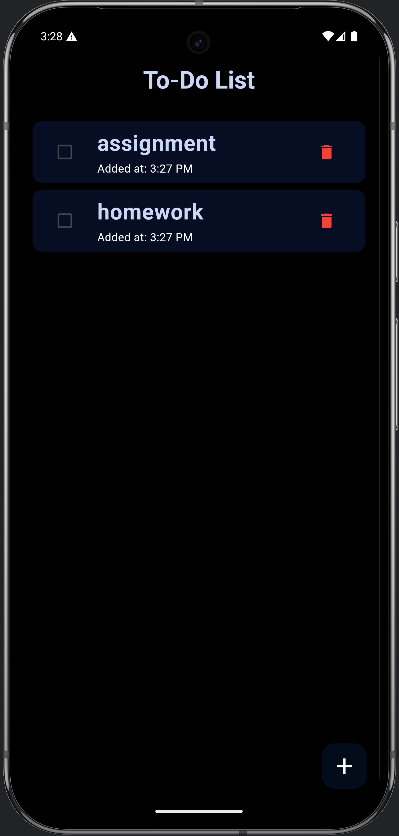

# 📝 To-Do List App **TaskZen**

A simple and user-friendly To-Do List app built with **Flutter**. This app allows users to add, complete, delete, and manage their tasks efficiently. Tasks are saved using **SharedPreferences**, so they persist even after restarting the app.

## 🚀 Features
✅ Add new tasks  
✅ Mark tasks as completed  
✅ Delete tasks  
✅ Display the creation time of each task  
✅ Persistent storage using SharedPreferences

## 📸 Screenshots
List Page:

Add task:

## 🛠️ Tech Stack
- **Flutter** (Dart)
- **SharedPreferences** for local storage

### Installation
1. **Clone the Repository**:
   git clone https://github.com/AvezChadchan/TaskZen.git
2. **Navigate to the Project**:
   cd TaskZen
3. **Get Dependencies**:
   flutter pub get
4. **Run the App**:
   flutter run

**Usage**
**Home Screen**: See a list of Taks with added time.

**Add Expense**:
Click the + button on the home screen.
Enter the Task.
Press "Add" to save the Task.

**Project Structure**:
lib/main.dart: Main app file with all screens and logic.
pubspec.yaml: Lists dependencies (shared_preferences).

**Dependencies**:
shared_preferences: For local storage.

**Contributing**:
This is a learning project, but feel free to fork and experiment! If you have suggestions, open an issue or submit a pull request.

**About**:
Built by **Avez Chadchan** as part of my Flutter learning journey. Inspired by the need to store the tasks without a backend.
